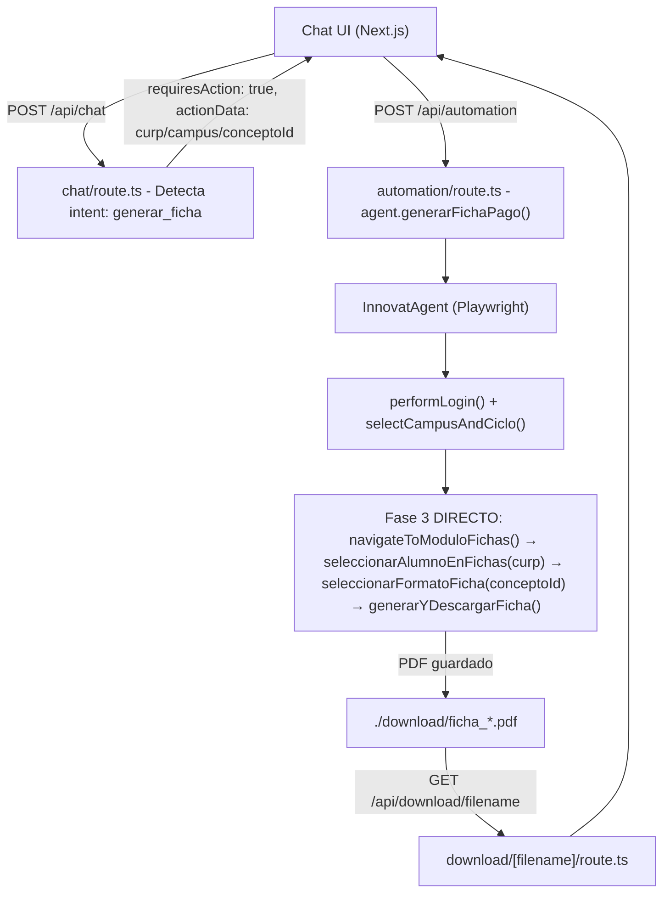
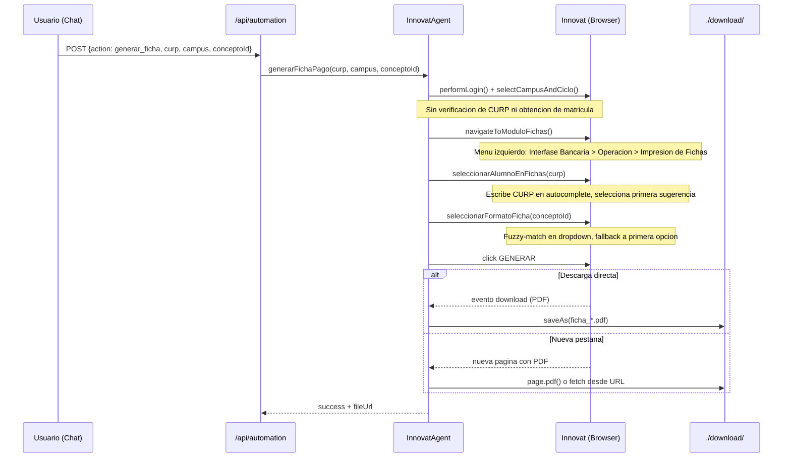

# Documento de Diseño: RPA Fase 3 — Generación de Ficha de Pago Referenciada (Innovat)

## Visión General

La Fase 3 completa el flujo RPA del chatbot del Colegio Cambridge de Monterrey. El flujo es **directo**: tras login y selección de campus, el agente navega al menú lateral izquierdo **Interfase Bancaria → Operación → Impresión de Fichas de Depósito por Alumno**, sin pasar por ninguna verificación de CURP ni obtención de matrícula previa.

Las Fases 1 (verificación CURP → matrícula) y 2 (estado de cuenta) ya funcionan y **no se tocan**. El trabajo de esta fase se concentra únicamente en reescribir `generarFichaPago` y sus métodos de soporte siguiendo el mismo patrón de `page.evaluate()` que usan las fases anteriores.

### Patrón de navegación de referencia (Fases 1 y 2)

Las fases existentes navegan menús así — este mismo patrón se replica en la Fase 3:

```typescript
// Ejemplo de navigateToEstadoCuenta (Fase 2) — patrón a seguir
const clickedCobros = await page.evaluate(() => {
  const spans = Array.from(document.querySelectorAll('span'));
  const target = spans.find(s => s.textContent?.trim() === 'Cobros');
  if (target) { target.click(); return true; }
  return false;
});
if (!clickedCobros) throw new Error('No se encontró el botón de Cobros');
await this.browser.wait(2000);
```

---

## Arquitectura de Alto Nivel



> Las Fases 1 y 2 (`consultarEstadoCuenta`) no se modifican. `generarFichaPago` ya no llama a `obtenerMatriculaDesdeCURP`.

---

## Flujo de Secuencia — Fase 3



---

## Componentes e Interfaces

### InnovatAgent — Métodos de Fase 3

```typescript
class InnovatAgent {
  // Punto de entrada público — se reescribe sin llamar a obtenerMatriculaDesdeCURP
  async generarFichaPago(
    curp: string,
    campus: string,
    conceptoId?: string   // texto libre: "colegiatura abril", "inscripcion", etc.
  ): Promise<AutomationResult>

  // Ya existe, se ajusta para seguir el patron de page.evaluate() de las fases 1/2
  private async navigateToModuloFichas(): Promise<AutomationResult>

  // NUEVO: busca al alumno por CURP en el autocomplete del modulo de fichas
  private async seleccionarAlumnoEnFichas(curp: string): Promise<AutomationResult>

  // NUEVO: selecciona el formato/mes en el dropdown con fuzzy-match
  private async seleccionarFormatoFicha(conceptoId?: string): Promise<AutomationResult>

  // CORREGIDO: maneja descarga directa Y nueva pestana
  private async generarYDescargarFicha(
    curp: string,
    conceptoId?: string
  ): Promise<AutomationResult>
}
```

---

## Modelos de Datos

### Parámetros de entrada a `generarFichaPago`

| Campo | Tipo | Requerido | Descripción |
|---|---|---|---|
| `curp` | string | Si | CURP validado (18 chars) |
| `campus` | string | Si | Nombre del campus (ej. "MITRAS") |
| `conceptoId` | string | No | Texto libre del concepto (ej. "colegiatura abril") |

---

## Pseudocódigo — Métodos Clave

### `generarFichaPago` (orquestador — flujo directo sin CURP previo)

```typescript
async generarFichaPago(curp, campus, conceptoId?) {
  const innovatCampus = getInnovatCampusValue(campus)
  if (!innovatCampus) return { success: false, error: 'Campus no valido' }

  await browser.initialize()

  const loginResult = await performLogin()
  if (!loginResult.success) { await browser.close(); return loginResult }

  await selectCampusAndCiclo(innovatCampus)

  // FASE 3: DIRECTO al modulo de fichas (sin verificar CURP ni obtener matricula)
  const navResult = await navigateToModuloFichas()
  if (!navResult.success) { await browser.close(); return navResult }

  const selResult = await seleccionarAlumnoEnFichas(curp)
  if (!selResult.success) { await browser.close(); return selResult }

  await seleccionarFormatoFicha(conceptoId)

  const fichaResult = await generarYDescargarFicha(curp, conceptoId)
  await browser.close()
  return fichaResult
}
```

---

### `navigateToModuloFichas` — menú lateral izquierdo

Sigue el mismo patrón `page.evaluate()` de las fases 1 y 2. El menú "Interfase Bancaria" está en el sidebar izquierdo, igual que "Cobros" en la Fase 2.

```typescript
private async navigateToModuloFichas(): Promise<AutomationResult> {
  // Precondicion: sesion activa, campus seleccionado
  // Postcondicion: pantalla de Impresion de Fichas de Deposito cargada

  // 1. Cerrar menus activos (mismo patron que Fase 2)
  await page.evaluate(() => {
    document.querySelectorAll('li.act_section').forEach(m => (m as HTMLElement).click())
  }).catch(() => {})
  await browser.wait(1000)

  // 2. Click en "Interfase Bancaria" (menu lateral izquierdo)
  //    Mismo patron que el click en "Cobros" de navigateToEstadoCuenta
  const clickedInterfase = await page.evaluate(() => {
    const spans = Array.from(document.querySelectorAll('span'))
    const target = spans.find(s => {
      const txt = s.textContent?.trim().toLowerCase()
      return txt === 'interfase bancaria' || txt === 'interfase'
    })
    if (target) { (target as HTMLElement).click(); return true }
    return false
  })
  if (!clickedInterfase) throw new Error('No se encontro el menu Interfase Bancaria')
  await browser.wait(2000)

  // 3. Click en "Operacion" (submenu visible)
  //    Mismo patron que el click en "Informacion" de navigateToEstadoCuenta
  const clickedOperacion = await page.evaluate(() => {
    const links = Array.from(document.querySelectorAll('a'))
    const target = links.find(a => {
      const txt = a.textContent?.trim().toLowerCase()
      const isVisible = (a as HTMLElement).offsetParent !== null
      return isVisible && (txt === 'operación' || txt === 'operacion')
    })
    if (target) { (target as HTMLElement).click(); return true }
    return false
  })
  if (!clickedOperacion) throw new Error('No se encontro el submenu Operacion')
  await browser.wait(2000)

  // 4. Click en "Impresion de Fichas de Deposito por Alumno"
  const clickedFichas = await page.evaluate(() => {
    const links = Array.from(document.querySelectorAll('a'))
    const target = links.find(a => {
      const txt = a.textContent?.trim().toLowerCase()
      const isVisible = (a as HTMLElement).offsetParent !== null
      return isVisible && (
        txt.includes('impresión de fichas') ||
        txt.includes('fichas de depósito') ||
        txt.includes('fichas de deposito')
      )
    })
    if (target) { (target as HTMLElement).click(); return true }
    return false
  })
  if (!clickedFichas) throw new Error('No se encontro Impresion de Fichas de Deposito por Alumno')

  await browser.wait(4000)
  await browser.captureScreenshot('fase3_modulo_fichas').catch(() => {})
  return { success: true }
}
```

**Precondiciones:** Login exitoso, campus seleccionado
**Postcondiciones:** Pantalla de Impresion de Fichas cargada y visible
**Error:** Captura screenshot en `./download/screenshots/fallo_navegacion_fichas.png`

---

### `seleccionarAlumnoEnFichas` — busca por CURP directamente

```typescript
private async seleccionarAlumnoEnFichas(curp: string): Promise<AutomationResult> {
  // Precondicion: pantalla de Impresion de Fichas cargada
  // Postcondicion: campo de alumno muestra el nombre del alumno seleccionado
  // Nota: usa el CURP directamente, no requiere matricula previa

  await browser.wait(2000)

  // 1. Localizar el input de busqueda con autocompletado
  //    Mismo patron que searchInCurrentPage() de las fases 1 y 2
  let input = page.locator('input[placeholder*="alumno"], input[placeholder*="matrícula"]').first()
  if (!await input.isVisible()) {
    input = page.locator('.uk-autocomplete input').first()
  }

  // 2. Escribir el CURP caracter a caracter para disparar el autocomplete
  await input.fill('')
  await input.type(curp, { delay: 150 })
  await browser.wait(3500)

  // 3. Seleccionar la PRIMERA sugerencia del dropdown (dinamica, no hardcodeada)
  const suggestion = page.locator(
    '.uk-dropdown li, .uk-autocomplete-results li, .uk-nav-autocomplete li'
  ).first()

  if (await suggestion.isVisible()) {
    await suggestion.click({ force: true })
    await browser.wait(1000)
  } else {
    // Fallback: teclado (mismo patron que searchInCurrentPage)
    await page.keyboard.press('ArrowDown')
    await browser.wait(300)
    await page.keyboard.press('Enter')
    await browser.wait(1000)
  }

  // 4. Verificar que el alumno quedo seleccionado
  const inputValue = await input.inputValue()
  if (inputValue.length < 3) {
    return { success: false, error: 'No se pudo seleccionar al alumno del autocomplete' }
  }

  return { success: true }
}
```

---

### `seleccionarFormatoFicha` — fuzzy-match en dropdown

```typescript
private async seleccionarFormatoFicha(conceptoId?: string): Promise<AutomationResult> {
  // Precondicion: alumno ya seleccionado
  // Postcondicion: dropdown de formato tiene una opcion seleccionada
  // Si conceptoId no coincide con ninguna opcion, se selecciona la primera valida (no es error)

  await browser.wait(1000)

  // Normalizar texto: minusculas, sin acentos
  const normalize = (s: string) => s.toLowerCase()
    .normalize('NFD').replace(/[\u0300-\u036f]/g, '')

  const formatSelect = page.locator('select').first()
  const options = await formatSelect.locator('option').all()

  if (options.length === 0) {
    console.log('[InnovatAgent] No se encontro dropdown de formatos, continuando...')
    return { success: true }
  }

  if (conceptoId) {
    const normalizedConcepto = normalize(conceptoId)
    for (const option of options) {
      const text = await option.textContent() || ''
      const normalizedOption = normalize(text)
      if (normalizedOption.includes(normalizedConcepto) || normalizedConcepto.includes(normalizedOption)) {
        const value = await option.getAttribute('value') || ''
        await formatSelect.selectOption({ value })
        console.log(`[InnovatAgent] Formato seleccionado: ${text}`)
        return { success: true }
      }
    }
  }

  // Fallback: primera opcion valida (no vacia)
  for (const option of options) {
    const value = await option.getAttribute('value') || ''
    const text = (await option.textContent() || '').trim()
    if (value && text) {
      await formatSelect.selectOption({ value })
      console.log(`[InnovatAgent] Formato por defecto: ${text}`)
      return { success: true }
    }
  }

  return { success: true }
}
```

---

### `generarYDescargarFicha` — estrategia dual (descarga directa o nueva pestaña)

```typescript
private async generarYDescargarFicha(curp: string, conceptoId?: string): Promise<AutomationResult> {
  // Precondicion: alumno y formato ya configurados
  // Postcondicion: PDF guardado en ./download/ y fileUrl retornada

  const fileName = `ficha_${curp}_${Date.now()}.pdf`
  const downloadPath = `./download/${fileName}`
  const fileUrl = `/api/download/${fileName}`

  await browser.wait(2000)

  // Escuchar tanto 'download' como nueva pagina ANTES de hacer clic
  const downloadPromise = page.waitForEvent('download', { timeout: 20000 })
  const newPagePromise = page.context().waitForEvent('page', { timeout: 20000 })

  // Hacer clic en GENERAR (mismo patron de busqueda que las fases anteriores)
  const clicked = await page.evaluate(() => {
    const candidates = Array.from(document.querySelectorAll('button, input[type="button"], input[type="submit"], a'))
    const btn = candidates.find(el => {
      const t = (el.textContent?.trim() || (el as HTMLInputElement).value || '').toUpperCase()
      const isVisible = (el as HTMLElement).offsetParent !== null
      return isVisible && (t === 'GENERAR' || t.includes('GENERAR'))
    }) as HTMLElement
    if (btn) { btn.click(); return true }
    return false
  })

  if (!clicked) {
    // Fallback: selector Playwright directo
    const btn = page.locator('button, input[type="submit"]').filter({ hasText: /GENERAR/i }).first()
    if (await btn.isVisible()) await btn.click()
    else return { success: false, error: 'No se encontro el boton GENERAR' }
  }

  // Esperar lo que llegue primero: descarga directa o nueva pestana
  try {
    const result = await Promise.race([downloadPromise, newPagePromise])

    if ('saveAs' in result) {
      // Caso A: descarga directa
      await result.saveAs(downloadPath)
      console.log(`[InnovatAgent] PDF descargado directamente: ${fileName}`)
    } else {
      // Caso B: nueva pestana con el PDF
      const newPage = result
      await newPage.waitForLoadState('networkidle', { timeout: 15000 })
      const pdfUrl = newPage.url()

      if (pdfUrl.includes('pdf') || pdfUrl.endsWith('.pdf')) {
        // Descargar el PDF desde la URL
        const response = await newPage.evaluate(async (url) => {
          const r = await fetch(url)
          const buf = await r.arrayBuffer()
          return Array.from(new Uint8Array(buf))
        }, pdfUrl)
        const fs = await import('fs/promises')
        await fs.writeFile(downloadPath, Buffer.from(response))
      } else {
        // Capturar como PDF via Playwright
        await newPage.pdf({ path: downloadPath })
      }
      await newPage.close()
      console.log(`[InnovatAgent] PDF capturado desde nueva pestana: ${fileName}`)
    }
  } catch (e) {
    return {
      success: false,
      error: 'Timeout esperando la generacion del PDF. El sistema Innovat puede estar lento.'
    }
  }

  return {
    success: true,
    data: {
      tipo: 'ficha_pago',
      fichaPago: {
        referencia: `REF-${Date.now()}`,
        concepto: conceptoId || 'Colegiatura',
        monto: 0,
        fechaLimite: new Date(),
        fileUrl,
      },
      mensaje: `Ficha de pago generada. Descargala aqui: ${fileUrl}`,
    },
  }
}
```

---

## Manejo de Errores

| Escenario | Condicion | Respuesta | Recuperacion |
|---|---|---|---|
| Alumno no encontrado | Input queda vacio tras escribir CURP | `seleccionarAlumnoEnFichas` retorna error | `generarFichaPago` cierra browser y retorna error al chat |
| Dropdown de formatos vacio | No hay `<select>` o no hay opciones | Continua sin seleccion (no es error fatal) | El flujo sigue, se genera la ficha del primer concepto disponible |
| Timeout en descarga | `Promise.race` agota 20s | Retorna error descriptivo | Chat sugiere reintentar |
| Navegacion fallida | No se encuentra "Interfase Bancaria" o submenus | Captura screenshot, retorna error | Screenshot en `./download/screenshots/fallo_navegacion_fichas.png` |

---

## Consideraciones de Seguridad

- El `curp` se valida con regex antes de llegar al agente (ya implementado en `automation/route.ts`).
- Los archivos PDF se guardan con nombre `ficha_<curp>_<timestamp>.pdf` — construido internamente, sin input del usuario.
- El endpoint `/api/download/[filename]` debe validar que `filename` no contenga `..` ni `/` para evitar path traversal.

---

## Dependencias

- **Playwright** — ya instalado
- **Node.js `fs/promises`** — para escritura del PDF
- **`/api/download/[filename]/route.ts`** — ya implementado, sin cambios
- **`performLogin`, `selectCampusAndCiclo`** — ya implementados, se reutilizan sin cambios
- **Fases 1 y 2** (`consultarEstadoCuenta`) — no se modifican
